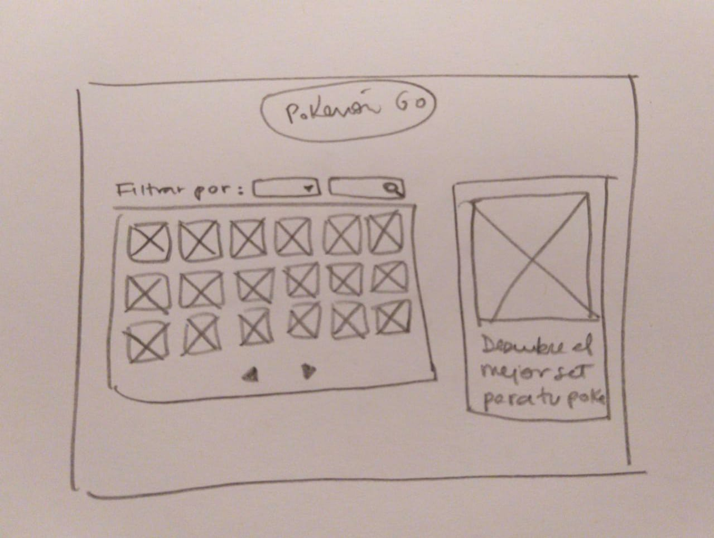
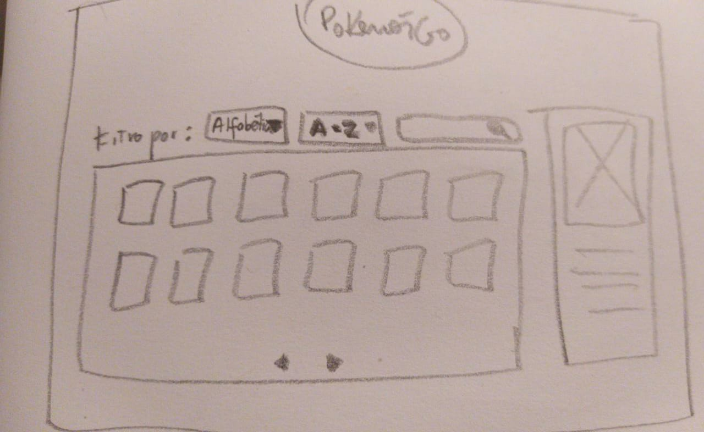
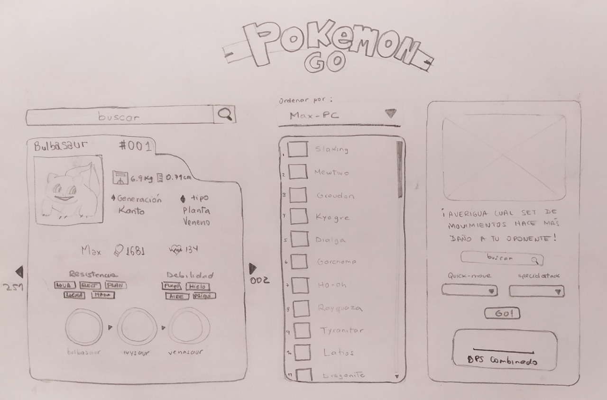
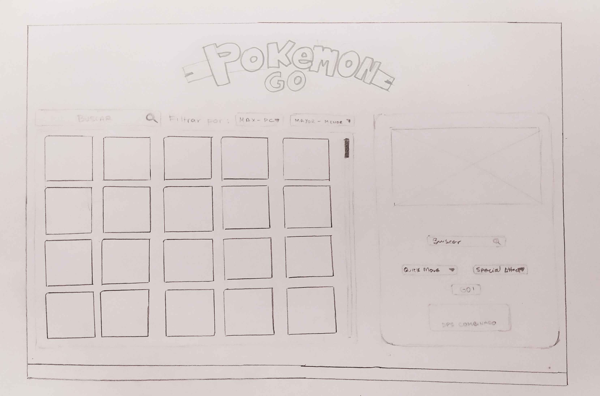
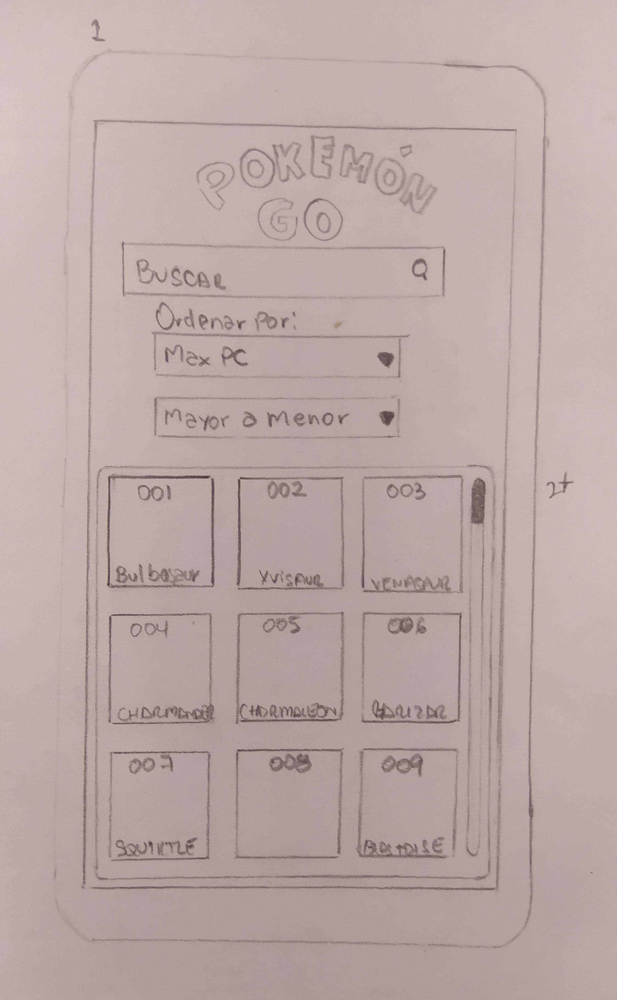
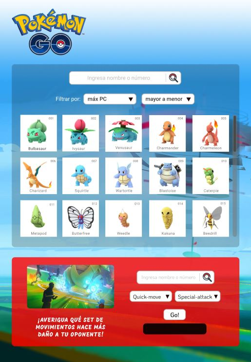
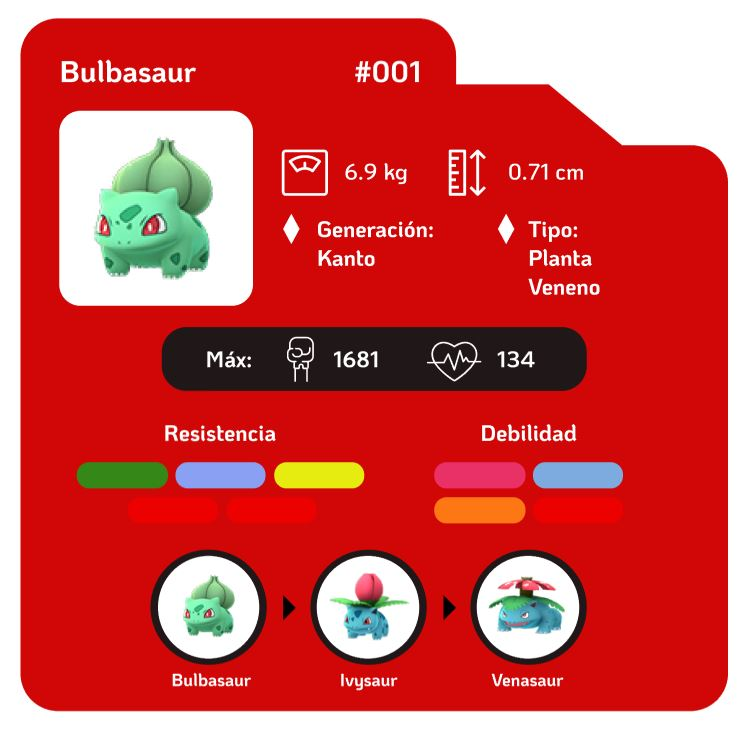

# Data Lovers

## Índice

* [1. Preámbulo](#1-preámbulo)
* [2. Resumen del proyecto](#2-resumen-del-proyecto)
* [3. Objetivos de aprendizaje](#3-objetivos-de-aprendizaje)
* [4. Consideraciones generales](#4-consideraciones-generales)
* [5. Criterios de aceptación mínimos del proyecto](#5-criterios-de-aceptación-mínimos-del-proyecto)
* [6. Hacker edition](#6-hacker-edition)
* [7. Consideraciones técnicas](#7-consideraciones-técnicas)
* [8. Pistas, tips y lecturas complementarias](#8-pistas-tips-y-lecturas-complementarias)
* [9. Checklist](#9-checklist)

***

## 1. Preámbulo

Según [Forbes](https://www.forbes.com/sites/bernardmarr/2018/05/21/how-much-data-do-we-create-every-day-the-mind-blowing-stats-everyone-should-read),
el 90% de la data que existe hoy ha sido creada durante los últimos dos años.
Cada día generamos 2.5 millones de terabytes de datos, una cifra sin
precedentes.

No obstante, los datos por sí mismos son de poca utilidad. Para que esas
grandes cantidades de datos se conviertan en **información** fácil de leer para
los usuarios, necesitamos entender y procesar estos datos. Una manera simple de
hacerlo es creando _interfaces_ y _visualizaciones_.

En la siguiente imagen, podrás ver cómo con la data que que se ve en la parte
izquierda se puede construir una interfaz amigable y entendible por el usuario
al lado derecho.


## 2. Resumen del proyecto

En este proyecto **construirás una _página web_ para visualizar un
_conjunto (set) de datos_** que se adecúe a lo que descubras que tu usuario
necesita.

Como entregable final tendrás una página web que permita **visualizar la data,
filtrarla, ordenarla y hacer algún cálculo agregado**. Con cálculo agregado
nos referimos a distintos cálculos que puedes hacer con la data para mostrar
información aún más relevante para los usuarios (promedio, el valor máximo
o mínimo, etc).

Esta vez te proponemos una serie de datos de diferentes _temáticas_ para que
explores y decidas con qué temática te interesa trabajar. Hemos elegido
específicamente estos sets de datos porque creemos que se adecúan bien a esta
etapa de tu aprendizaje.

Una vez que definas tu área de interés, buscar entender quién es tu usuario
y qué necesita saber o ver exactamente; luego podrás construir la interfaz que
le ayude a interactuar y entender mejor esos datos.

Estos son datos que te proponemos:

* [Pokémon](src/data/pokemon/pokemon.json):
  En este set encontrarás una lista con los 251 Pokémon de la región de Kanto
  y Johto, junto con sus respectivas estadísticas usadas en el juego
  [Pokémon GO](http://pokemongolive.com).
   - [Investigación con jugadores de Pokémon Go](/src/data/pokemon/README.md)

* [League of Legends - Challenger leaderboard](src/data/lol/lol.json):
  Este set de datos muestra la lista de campeones en una liga del
  juego League of Legends (LoL).
   - [Investigación con jugadores de LoL](/src/data/lol/README.md)

* [Atletas Olímpicos](src/data/atletas/atletas.json).
  Este set nos proporciona la lista de los atletas que ganaron medallas en las
  olímpiadas de invierno y verano del siglo XXI.
   - [Investigación con interesados en atletas olímpicos](/src/data/atletas/README.md)

<!---
¡Too much information para comenzar (Diego)!
Una opción serían cálculos estadísticos como el promedio, el máximo o el mínimo,
por ejemplo, si tenemos una colección que representa a un grupo de personas,
y cada persona está representada como un _objeto_ con una _propiedad_ `altura`,
podríamos elegir calcular la altura promedio en el grupo entre otras cosas.
--->

## 3. Objetivos de aprendizaje

El objetivo principal de este proyecto es que, entendiendo las necesidades de
tus usuarios, aprendas a diseñar y construir una interfaz web donde se pueda
visualizar y manipular data.

Revisa la lista y reflexiona sobre los objetivos que conseguiste en el
proyecto anterior. Piensa en eso al decidir tu estrategia de trabajo individual
y de equipo.

### UX

- [✓] Diseñar la aplicación pensando y entendiendo al usuario.
- [✓] Crear prototipos para obtener _feedback_ e iterar.
- [✓] Aplicar los principios de diseño visual (contraste, alineación, jerarquía).
- [ ] Planear y ejecutar _tests_ de usabilidad.

### HTML y CSS

- [✓] Entender y reconocer por qué es importante el HTML semántico.
- [✓] Identificar y entender tipos de selectores en CSS.
- [✓] Entender como funciona `flexbox` en CSS.
- [✓] Construir tu aplicación respetando el diseño planeado (maquetación).

### DOM

- [✓] Entender y reconocer los selectores del DOM (`querySelector` | `querySelectorAll`).
- [✓] Manejar eventos del DOM. (`addEventListener`)
- [✓] Manipular dinámicamente el DOM. (`createElement`, `appendchild`, `innerHTML`, `value`)

### Javascript

- [✓] Manipular arrays (`filter` | `map` | `sort` | `reduce`).
- [✓] Manipular objects (key | value).
- [✓] Entender el uso de condicionales (`if-else` | `switch`).
- [✓] Entender el uso de bucles (`for` | `forEach`).
- [ ] Entender la diferencia entre expression y statements.
- [✓] Utilizar funciones (`parámetros` | `argumentos` | `valor de retorno`).
- [ ] Entender la diferencia entre tipos de datos atómicos y estructurados.
- [✓] Utilizar ES Modules (`import` | `export`).

### Pruebas Unitarias (_testing_)
- [ ] Testear funciones (funciones puras).

### Git y GitHub
- [✓] Ejecutar comandos de git (`add` | `commit` | `pull` | `status` | `push`).
- [✓] Utilizar los repositorios de GitHub (`clone` | `fork` | `gh-pages`).
- [✓] Colaborar en Github (`pull requests`).

### Buenas prácticas de desarrollo
- [✓] Organizar y dividir el código en módulos (Modularización).
- [✓] Utilizar identificadores descriptivos (Nomenclatura | Semántica).
- [✓] Utilizar linter para seguir buenas prácticas (ESLINT).

## 4. Consideraciones generales

* Este proyecto se debe resolver en duplas.
* El proyecto será entregado subiendo tu código a GitHub (commit/push) y la
  interfaz será desplegada usando [GitHub Pages](https://pages.github.com/).
* Tiempo para completarlo: Toma como referencia 4 semanas.

## 5. Criterios de aceptación mínimos del proyecto

Los criterios para considerar que has completado este proyecto son:

### Definición del producto

Documenta brevemente tu trabajo en el archivo `README.md` de tu repositorio,
contándonos cómo fue tu proceso de diseño y cómo crees que el producto resuelve
el problema (o problemas) que tiene tu usuario.

**Público objetivo:** Jugador principiante de Pokemón Go que desea saber información extra de cada pokemón y saber que set de movimientos es el adecuado para ganar una batalla pokemón.

**Descripción:** Es una página web donde el usuario podrá encontrar los 251 pokemones de las regiones de Kanto y Johto. Podrá ordenar los pokemon alfabéticamente, podrá filtrarlos según el tipo y ordenarlo según el máx CP. Además podrá ver que Set de Movimientos es el más adecuado para su pokemón para que pueda usarlo en las batallas pokemón. Podrá también ver información extra de cada pokemón (peso, altura, generación, tipo, máx-cp, máx-hp, evoluciones, a qué pokemones es débil y resistente).

### Historias de usuario

**Historia de usuario 1:** 

Como <<jugadorx pokemon >>
Quiero <<ver una lista de los pokemon>>
Para <<tener acceso a una vista rápida de los pokemon>>

**Criterios de aceptación:**

1. Las y los usuarios verán una galería pokemon ordenada según el número de la pokedex.
2. Verán 18 de 251 pokemon al ingresar a la página. El usuario podrá hacer uso del scroll para ver los demás pokemon. 

**Definición de terminado**

1. Se ha implementado una función que mostrará los 251 pokemones.
2. Delimitar el contenedor donde irán los pokemon. Crear un scroll para que el usuario pueda recorrer la lista de pokemon.
3. El código se subió al repositorio de Git Hub.
4. El código se trabajó en pair-programming.
5. La historia se testeó en usuarios reales y se hicieron los cambios resultantes del testeo.
6. La página debe ser responsive. En versión mobile debe mostrar un listado de 6 pokemon y el scroll debe recorrer la lista de los 251 pokemon.

**Historia de usuario 2:**

Como <<jugadorx pokemon >>
Quiero <<buscar a un pokemón según su nombre o número>>
Para <<saber sus características principales>>

**Criterios de aceptación:**

1. Las y los usuarios verán un buscador donde podrán escribir el nombre o número del pokemon a buscar.
2. La galería de pokemon se actualizará según la búsqueda. Puede mostrar coincidencias o solo un pokemon.
3. De no encontrar coincidencias mostrará un texto "no se encontraron coincidencias".
4. el usuario podrá hacer la búsqueda de otro pokemon usando el buscador.

**Definición de terminado:**

1. El buscador arrojará las coincidencias.
2. El mensaje de alerta debe funcionar cuando no haya coincidencias en la data.
3. La galería debe mostrar los pokemon según la búsqueda.
4. Hacer el test para comprobar si llama a todos los pokemon, si acepta mayúsculas o minúsculas y si detecta el ingreso inválido(devuelve true o false).
5. El código se subió al repositorio de Git Hub.
6. El código se trabajó en pair-programming.
7. La historia se testeó en usuarios reales y se hicieron los cambios resultantes del testeo.

**Historia de usuario 3:**

Yo como <<jugadorx Pokemón>>
Quiero <<ver información detallada de un pokemon>>
Para <<conocer los datos mas relevantes sobre ese pokemon(nombre, peso, altura, generación, tipo y resistencia, evolución)>>

**Criterios de aceptación:**
1. Las y los usuarios, al hacer click sobre las imagenes de la galería  tendrán acceso a informacion detallada de cualquier pokemon mediante un ventana emergente. 
2. Podrán salir de la ventana al pulsar en X.

**Definición de terminado:**
1. La ventana emergente debe mostrar los valores específicos segun el recorrido de la data.
2. El botón x debe regresar a la página principal.
3. Hacer el test para comprobar si llama a la información de cada pokemon. (No se necesitó test).
5. El código se subió al repositorio de Git Hub.
6. El código se trabajó en pair-programming.

**Historia de usuario 5:**

Yo como <<jugadorx pokemon >>
Quiero <<poder filtrar a los pokemon por tipo >>
Para <<identificar a un grupo de pokemon rápidamente cuando solo recuerdo alguna característica en especial >>

**Criterios de aceptación:**

1. Las y los usuarios verán un menú desplegable. Donde se listará los tipo de pokemon. 
2. Al dar clic, el menú desplegable muestra las opciones de todos los tipos de pokemon (agua, tierra, fuego, eléctrico, entre otros). El usuario podrá escoger entre las opciones.
3. según la opción escogida, la galería se actualizará y el usuario podrá usar el scroll para encontrar al pokemón deseado. 
4. Podrán escoger otro tipo de pokemon y la galería se actualizará según el tipo solicitado.

**Definición de terminado:**

1. Al dar clic al botón de filtro "tipo" debe mostrar las opciones de los tipos de pokemon.
2. el filtro debe recorrer la data según "type" y ordenar los nombres según el tipo correctamente.
2. Los pokemon que se muestren debe ser del tipo escogido.
3. El código se subió al repositorio de Git Hub.
4. Hacer el test para comprobar si hace el filtro correcto.
5. El código se trabajó en pair-programming.
6. La historia se testeó en usuarios reales y se hicieron los cambios resultantes del testeo.

**Historia de usuario 4:**

Yo como <<jugadorx pokemon >>
Quiero <<ordenar a los pokemon de forma ascendente o descendente>>
Para <<encontrar más fácilmente los primeros o últimos pokemón según su nombre>>

**Criterios de aceptación:**

1. Los y las usuarias verán un menú desplegable para ordenar a los pokemones alfabeticamente. 
2. Al dar clic, el menú desplegable muestra las opciones A-Z y Z-A. Podrán escoger entre las 2 opciones.
3. Según la opción escogida, la galería se actualizará y el usuario podrá usar el scroll para encontrar al pokemón deseado. 

**Definición de terminado**

1. Al dar clic al botón "ordenar o sort" debe mostrar las opciones de orden de la A-Z y Z-A
2. La función debe recorrer la data según "name" y ordenar los nombres alfabética y correctamente.
2. Los pokemon que se muestren debe ordenarse según A-Z o Z-A.
3. El código se subió al repositorio de Git Hub.
4. Hacer el test para comprobar si ordena correctamente.
5. El código se trabajó en pair-programming.
6. La historia se testeó en usuarios reales y se hicieron los cambios resultantes del testeo.

**Historia de usuario 6:**

Yo como <<jugadorx pokemon >>
Quiero <<ordenar a los pokemon por PC máximo>>
Para <<saber hasta donde llegará el max PC de mis pokemones y así entrenarlos para ello>>

**Criterios de aceptación:**
1. Los y las usuarias verán un menú desplegable para ordenar a los pokemones según PC máx.
2. Al dar clic, el menú desplegable muestra las opciones de ordenar mayor-menor o menor-mayor.
3. Según la opción escogida, la galería se actualizará y el usuario podrá usar el scroll para encontrar al pokemón deseado. 
4. Los y las usuarias podrán escoger ordenar y/o filtrar la galería de otro modo y esta se actualizará según lo solicitado.

**Definición de terminado:**

1. Al dar clic al botón de orden "max-PC" debe mostrar las opciones de orden de mayor-menor y menor-mayor.
2. La función debe recorrer la data según "máx-PC" y ordenar los pokemon según el máx puntaje de combate.
2. Los pokemon que se muestren debe ser del orden escogido.
3. El código se subió al repositorio de Git Hub.
4. Hacer el test para comprobar si hace el orden correcto.
5. El código se trabajó en pair-programming.
6. La historia se testeó en usuarios reales y se hicieron los cambios resultantes del testeo.

**Historia de usuario 7:**

Yo como <<jugadorx Pokemón>>
Quiero <<Conocer el mejor set de movimientos de mi pokemón>>
Para <<para saber cuanto daño puedo generar a mi oponente en una batalla pokemón>>

**Criterios de aceptación:**

1. Los y las usuarias podrán ver en la página un seccion que dirá: ¡Averigua qué set de movimiento hace más daño a tu oponente!
2. Se deberá ingresar el nombre del pokemón en un buscador para seleccionarlo.
3. Los y las usuarias deberán escoger el quick-move y el special-atack del pokemon seleccionado.
4. Darán click en Go! para calcular su mejor mov-set.
5. El resultado sera mostrado en la parte inferior de esta sección.

**Definición de Terminado:**

1. El buscador debe encontrar al pokemon deseado.
   El buscador recibirá la data que es arrObj, se recorrerá ese array y ubicará la propiedad name, crearemos un espacio debajo del buscador donde aparecerá el nombre del pokemon seleccionado, (Veamos que puedes lograr con name_del_pokemon) aquí podemos usar coincidencias function (seria bueno si mostrará las coincidencias mientras escribe) 
2. Los menús desplegables de los quick-move y de los special-attack deben funcionar en base al pokemon buscado. 
  Aparecerán en cuanto el pokemon buscado sea seleccionado. 
Propiedad: quick-move.name
Propiedad: special-attack.name
Deberá seleccionar un ítem de cada lista (radio button) la selección debe ser === al valor en data
3. Las variables deben coger los valores adecuados (base-damage, energy, move-duration-seg)

4. Las funciones deben hacer las operaciones de manera correcta.
5. El resultado se debe mostrar de manera correcta en la web.
6. El código se subió al repositorio de Git Hub.
7. Hacer el test para comprobar si coge los valores correctos y si hace la fórmula correctamente.
8. El código se trabajó en pair-programming.
9. La historia se testeó en usuarios reales y se hicieron los cambios resultantes del testeo.

### Diseño de la Interfaz de Usuario

#### Prototipo de baja fidelidad

Durante tu trabajo deberás haber hecho e iterado bocetos (_sketches_) de tu
solución usando papel y lápiz. Te recomendamos tomar fotos de todas las
iteraciones que hagas, que las subas a tu repositorio y las menciones en tu
`README.md`.

Primeros bosquejos:


Este fue el primer prototipo que hicimos de nuestra web y el feedback que recibimos fue que las imágenes eran demasiado grandes y no se entendía lo que debían hacer en el menú superior, también se noto que las imágenes eran muy pocas, no se sabía si eran las únicas.

Deberia tener un espacio donde tener la cantidad de pokemones se ven o un scroll o botones avanzar y retroceder, eso lo quisismos usar luego decidimos que no, ya que no sabíamos si podrñiamos hacerlo en el tiempo que teníamos.

El feedback fue que podríamos poner mejorara el espacio del moveset, ya que si es algo importante no deberí ser tan pequeño o escondido. 

En este bosquejo el feedback fue que la pokedex no tenía mucho sentido de ponerlo junto a la búsqueda porque ya estaría ahí, se nos sugirió que la pokedex debería ser consecuencia de la búsqueda y mostrar los pokemones un poco mas grandecitos, para que se tenga una vista rápida, la lista que está al medio decidimos sacarla y agrandar el contenedor de los pokemones.





#### Prototipo de alta fidelidad

Lo siguiente es diseñar tu Interfaz de Usuario (UI por sus siglas en inglés -
_User Interface_). Para eso debes aprender a utilizar alguna herramienta de
diseño visual. Nosotros te recomendamos [Figma](https://www.figma.com/) que es
una herramienta que funciona en el navegador y, además, puedes crear una cuenta
gratis. Sin embargo, eres libre de utilizar otros editores gráficos como
Illustrator, Photoshop, PowerPoint, Keynote, etc. Recuerda utilizar la
[identidad gráfica](https://drive.google.com/open?id=1eeWFqrWpy-OYOH4EHDckFGunyrm9iNeE)
correspondiente a cada set de datos que elijas.

El diseño debe representar el _ideal_ de tu solución. Digamos que es lo que
desearías implementar si tuvieras tiempo ilimitado para trabajar. Además, tu
diseño debe seguir los fundamentos de _visual design_.







#### Testeos de usabilidad

Durante el reto deberás hacer _tests_ de usabilidad con distintos usuarios, y
en base a los resultados, deberás iterar tus diseños. Cuéntanos
qué problemas de usabilidad detectaste a través de los _tests_ y cómo los
mejoraste en tu propuesta final.

### Implementación de la Interfaz de Usuario (HTML/CSS/JS)

Luego de diseñar tu interfaz de usuario deberás trabajar en su implementación.
**No** es necesario que construyas la interfaz exactamente como la diseñaste.
No tienes tiempo ilimitado para trabajar, así es que deberás priorizar.

Como mínimo, tu implementación debe:

1. Mostrar la data en una interfaz: puede ser un card, una tabla, una lista,
   etc.
2. Permitir al usuario interactuar para obtener la infomación que necesita.
   <!--filtrar y ordenar la data.-->
3. Ser _responsive_, es decir, debe visualizarse sin problemas desde distintos
   tamaños de pantallas: móviles, tablets y desktops.
4. Que la interfaz siga los fundamentos de _visual design_.

### Pruebas unitarias

El _boilerplate_ de este proyecto no incluye Pruebas Unitarias (_tests_), así es
que  tendrás que escribirlas tú para las funciones que tenga tu código.
<!--encargadas de  _procesar_, _filtrar_ y _ordenar_ la data, así
como _calcular_ estadísticas.-->

Tus _pruebas unitarias_ deben dar una cobertura del 70% de _statements_
(_sentencias_), _functions_ (_funciones_), _lines_ (_líneas_), y _branches_
(_ramas_) del archivo `src/data.js` que contenga tus funciones y está detallado
en la sección de [Consideraciones técnicas](#srcdatajs).

## 6. Hacker edition

Las secciones llamadas _Hacker Edition_ son **opcionales**. Si **terminaste**
con todo lo anterior y te queda tiempo, intenta completarlas. Así podrás
profundizar y/o ejercitar más sobre los objetivos de aprendizaje del proyecto.

Features/características extra sugeridas:

* En lugar de consumir la data estática brindada en este repositorio, puedes
  consumir la data de forma dinámica, cargando un archivo JSON por medio de
  `fetch`. La carpeta `src/data` contiene una versión `.js` y una `.json` de
  de cada set datos.
* Agregarle a tu interfaz de usuario implementada visualizaciones gráficas. Para
  ello te recomendamos explorar librerías de gráficas como
  [Chart.js](https://www.chartjs.org/)
  o [Google Charts](https://developers.google.com/chart/).
* 100% Coverage

## 7. Consideraciones técnicas

La lógica del proyecto debe estar implementada completamente en JavaScript
(ES6), HTML y CSS. En este proyecto NO está permitido usar librerías o
frameworks, solo [vanilla JavaScript](https://medium.com/laboratoria-how-to/vanillajs-vs-jquery-31e623bbd46e),
con la excepción de librerías para hacer gráficas (charts); ver
[_Parte opcional_](#6-hacker-edition) más arriba.

No se debe utilizar la _pseudo-variable_ `this`.

El _boilerplate_ contiene una estructura de archivos como punto de partida así
como toda la configuración de dependencias:

```text
.
├── EXTRA.md
├── README.md
├── package.json
├── src
|  ├── data (según con qué data trabajes)
|  |  ├── lol
|  |  |  ├── lol.js
|  |  |  ├── lol.json
|  |  |  └── README.md
|  |  ├── pokemon
|  |  |  ├── pokemon.js
|  |  |  ├── pokemon.json
|  |  |  └── README.md
|  |  └── atletas
|  |     ├── atletas.js
|  |     └── atletas.json
|  |     └── README.md
|  ├── data.js
|  ├── index.html
|  ├── main.js
|  └── style.css
└── test
   └── data.spec.js

directory: 6 file: 17
```

### `src/index.html`

Como en el proyecto anterior, existe un archivo `index.html`. Como ya sabes,
acá va la página que se mostrará al usuario. También nos sirve para indicar
qué scripts se usarán y unir todo lo que hemos hecho.

### `src/main.js`

Recomendamos usar `src/main.js` para todo tu código que tenga que ver con
mostrar los datos en la pantalla. Con esto nos referimos básicamente a la
interacción con el DOM. Operaciones como creación de nodos, registro de
manejadores de eventos (_event listeners_ o _event handlers_), ....

Esta no es la única forma de dividir tu código, puedes usar más archivos y
carpetas, siempre y cuando la estructura sea clara para tus compañeras.

En este archivo encontrarás una serie de _imports_ _comentados_. Para _cargar_
las diferentes fuentes de datos tendrás que _descomentar_ la línea
correspondiente.

Por ejemplo, si "descomentamos" la siguiente línea:

```js
// import data from './data/pokemon/pokemon.js';
```

La línea quedaría así:

```js
import data from './data/pokemon/pokemon.js';
```

Y ahora tendríamos la variable `data` disponible en el script `src/main.js`.

### `src/data.js`

El corazón de este proyecto es la manipulación de datos a través de arreglos
y objetos.

Te reomendamos que este archivo contenga toda la funcionalidad que corresponda
a obtener, procesar y manipular datos (tus funciones). Por ejemplo:

* `filterData(data, condition)`: esta función `filter` o filtrar recibiría la
  data, y nos retornaría aquellos datos que sí cumplan con la condición.

* `sortData(data, sortBy, sortOrder)`: esta función `sort` u ordenar
  recibe tres parámetros.
  El primer parámetro, `data`, nos entrega los datos.
  El segundo parámetro, `sortBy`, nos dice con respecto a cuál de los campos de
  la data se quiere ordenar.
  El tercer parámetro, `sortOrder`, indica si se quiere ordenar de manera
  ascendente o descendente.

* `computeStats(data)`: la función `compute` o calcular, nos permitirá hacer
  cálculos estadísticos básicos para ser mostrados de acuerdo a la data
  proporcionada.

Estos nombres de funciones y de parámetros son solamente referenciales, lo que
decidas depende de tu propia implementación.

Estas funciones deben ser [_puras_](https://medium.com/laboratoria-developers/introducci%C3%B3n-a-la-programaci%C3%B3n-funcional-en-javascript-parte-2-funciones-puras-b99e08c2895d)
e independientes del DOM. Estas funciones serán después usadas desde el archivo
`src/main.js`, al cargar la página, y cada vez que el usuario interactúe (click,
filtrado, ordenado, ...).

### `src/data`

En esta carpeta están los datos de las diferentes fuentes. Encontrarás una
carpeta por cada fuente, y dentro de cada carpeta dos archivos: uno con la
extensión `.js` y otro `.json`. Ambos archivos contienen la misma data; la
diferencia es que el `.js` lo usaremos a través de una etiqueta `<script>`,
mientras que el `.json` está ahí para opcionalmente cargar la data de forma
asíncrona con [`fetch()`](https://developer.mozilla.org/es/docs/Web/API/Fetch_API)
(ver sección de [_Parte Opcional_](#6-hacker-edition)).

### `test/data.spec.js`

Tendrás también que completar las pruebas unitarias de las funciones
implementadas en el archivo `data.js`.

## 8. Pistas, tips y lecturas complementarias

### Primeros pasos

Antes de empezar a escribir código, debes definir qué deberá hacer el producto
en base al conocimiento que puedas obtener de tu usuario. Estas preguntas te
pueden ayudar:

* ¿Quiénes son los principales usuarios de producto?
* ¿Cuáles son los objetivos de estos usuarios en relación con el producto?
* ¿Cuáles son los datos más relevantes que quieren ver en la interfaz y por qué?
* ¿Cuándo utilizan o utilizarían el producto?
* Toda tu investigación previa debe tener como resultado todas las Historias
  de Usuario de tu proyecto.
* No hagas los prototipos de alta fidelidad de todas tus Historias. Comienza
  solamente por los que se necesiten para tu Sprint 1 (semana 1 de trabajo). Más
  pistas en la guía de organización para el proyecto.

Cuando ya estés lista para codear, te sugerimos empezar de esta manera:

1. Una de las integrantes del equipo debe realizar un :fork_and_knife:
   [fork](https://help.github.com/articles/fork-a-repo/) del repo de tu cohort,
   tus _coaches_ te compartirán un _link_ a un repo y te darán acceso de lectura
   en ese repo. La otra integrante del equipo deber hacer un fork **del
   repositorio de su compañera** y
   [configurar](https://gist.github.com/BCasal/026e4c7f5c71418485c1) un `remote`
   hacia el mismo.
2. :arrow_down: [Clona](https://help.github.com/articles/cloning-a-repository/)
   tu _fork_ a tu computadora (copia local).
3. 📦 Instala las dependencias del proyecto con el comando `npm install`. Esto
   asume que has instalado [Node.js](https://nodejs.org/) (que incluye [npm](https://docs.npmjs.com/)).
4. Si todo ha ido bien, deberías poder ejecutar las :traffic_light:
   pruebas unitarias (unit tests) con el comando `npm test`.
5. Para ver la interfaz de tu programa en el navegador, usa el comando
  `npm start` para arrancar el servidor web y dirígete a
  `http://localhost:5000` en tu navegador.
6. A codear se ha dicho! :rocket:

<!--
En este proyecto deberás trabajar colaborativamente. Para ello, una de las
integrantes del equipo deberá forkear el repositorio del cohort y la otra
integrante **deberá hacer un fork del repositorio de su compañera**. Luego de
esto, deberás
[configurar](https://help.github.com/articles/configuring-a-remote-for-a-fork/)
un `remote` hacia el repositorio del cual hiciste el fork.

Para mandar cambios desde un repositorio forkeado al original debes crear un
[pull request](https://goo.gl/4bYnuh)
y el propietario del repositorio original recibirá una notificación para
[revisar el pull request](https://goo.gl/XSFcT5)
y [aceptar los cambios](https://goo.gl/HLJtqN).

Aquí algunas recomendaciones para que organices mejor el trabajo con tu
compañera:

* En lugar de trabajar en una sola rama o _branch_, puedes organizar el flujo de
  trabajo con dos ramas principales:
  - `master`: rama que contiene las funcionalidades terminadas y sin errores.
  - `develop`: rama dónde integrarás las funcionalidades conforme las vayas
    desarrollando.

* Además de tener las dos ramas anteriores, puedes trabajar cada nueva
  funcionalidad en una rama individual (_feature branches_), estas ramas en
  lugar de crearse a partir de `master`, tienen a `develop` como su rama de
  origen. Cuando una funcionalidad es terminada se integra de nuevo a `develop`.
  Las _feature branches_ no se deben integrar directamente a `master`.

* Por último, te sugerimos codear usando la técnica de
  [pair programming](https://goo.gl/uAMBX2).

¿Quieres saber más forks y pull requests?

* Un [fork](https://help.github.com/articles/fork-a-repo/) es una copia de un
  repositorio en el que puedes experimentar sin afectar al repositorio original.
  Generalmente se usa para proponer cambios al proyecto de alguien más o para
  usar el proyecto de otra persona como punto de partida para una idea que
  quieras realizar.

* Un [pull request](https://help.github.com/articles/about-pull-requests/) (PR)
  te permite solicitar la inclusión de cambios al repositorio original (tu punto
  de partida) en GitHub. Cuando un PR es abierto, este permite solicitar,
  discutir y revisar los cambios realizados con todos los colaboradores y
  agregar otros commits antes de que los cambios sean incluidos al repositorio
  original.
-->

***

### Contenido de referencia

#### Diseño de experiencia de usuario (User Experience Design)

* Investigación con usuarios / entrevistas
* Principios de diseño visual

#### Desarrollo Front-end

* Unidad de testing en curso de JavaScript en LMS.
* Unidad de arreglos en curso de JavaScript en LMS.
* Unidad de objetos en curso de JavaScript en LMS.
* Unidad de funciones en curso de JavaScript en LMS.
* Unidad de DOM en curso de Browser JavaScript en LMS.
* [Array en MDN](https://developer.mozilla.org/es/docs/Web/JavaScript/Referencia/Objetos_globales/Array)
* [Array.sort en MDN](https://developer.mozilla.org/es/docs/Web/JavaScript/Referencia/Objetos_globales/Array/sort)
* [Array.map en MDN](https://developer.mozilla.org/es/docs/Web/JavaScript/Referencia/Objetos_globales/Array/map)
* [Array.filter en MDN](https://developer.mozilla.org/es/docs/Web/JavaScript/Referencia/Objetos_globales/Array/filter)
* [Array.reduce en MDN](https://developer.mozilla.org/es/docs/Web/JavaScript/Referencia/Objetos_globales/Array/reduce)
* [Array.forEach en MDN](https://developer.mozilla.org/es/docs/Web/JavaScript/Referencia/Objetos_globales/Array/forEach)
* [Object.keys en MDN](https://developer.mozilla.org/es/docs/Web/JavaScript/Referencia/Objetos_globales/Object/keys)
* [Object.entries en MDN](https://developer.mozilla.org/es/docs/Web/JavaScript/Referencia/Objetos_globales/Object/entries)
* [Fetch API en MDN](https://developer.mozilla.org/en-US/docs/Web/API/Fetch_API)
* [json.org](https://json.org/json-es.html)
* [expressions-vs-statements](https://2ality.com/2012/09/expressions-vs-statements.html)
* [expresión vs sentencia](https://openclassrooms.com/en/courses/4309531-descubre-las-funciones-en-javascript/5108986-diferencia-entre-expresion-y-sentencia)
* [datos atomicos vs datos estructurados](https://www.todojs.com/tipos-datos-javascript-es6/)
* [Modulos: Export](https://developer.mozilla.org/es/docs/Web/JavaScript/Referencia/Sentencias/export)
* [Modulos: Import](https://developer.mozilla.org/es/docs/Web/JavaScript/Referencia/Sentencias/import)

#### Herramientas

* [Git](https://git-scm.com/)
* [GitHub](https://github.com/)
* [GitHub Pages](https://pages.github.com/)
* [Node.js](https://nodejs.org/)
* [Jest](https://jestjs.io/)

#### Organización del Trabajo

* [Historias de Usuario](https://www.youtube.com/watch?v=ky6wFiF5vMk&t=344s).
  Ojo que Cris no diferencia _Definición de terminado_ de _Criterios de
  Aceptación_ y nosotros sí lo haremos. Más detalles en la guía.
* [Cómo dividir H.U.](https://www.youtube.com/watch?v=Ueq786iZ30I&t=341s)
* [Guía para Data Lovers](https://docs.google.com/presentation/d/e/2PACX-1vQhx9D36NjpH-Daea-ITPUDUzNL8ZiNAprq_7b5PSUrfutk45tEtaOLz2lmd8f54_5jX1hypDM8f8SM/pub?start=false&loop=false&delayms=60000)

***

## 9. Checklist

* [ ] Usa VanillaJS.
* [ ] No hace uso de `this`.
* [ ] Pasa linter (`npm run pretest`)
* [ ] Pasa tests (`npm test`)
* [ ] Pruebas unitarias cubren un mínimo del 70% de statements, functions y
  lines y branches.
* [ ] Incluye _Definición del producto_ clara e informativa en `README.md`.
* [ ] Incluye historias de usuario en `README.md`.
* [ ] Incluye _sketch_ de la solución (prototipo de baja fidelidad) en
  `README.md`.
* [ ] Incluye _Diseño de la Interfaz de Usuario_ (prototipo de alta fidelidad)
  en `README.md`.
* [ ] Incluye link a Zeplin en `README.md`.
* [ ] Incluye el listado de problemas que detectaste a través de tests de
  usabilidad en el `README.md`.
* [ ] UI: Muestra lista y/o tabla con datos y/o indicadores.
* [ ] UI: Permite ordenar data por uno o más campos (asc y desc).
* [ ] UI: Permite filtrar data en base a una condición.
* [ ] UI: Es _responsive_.
